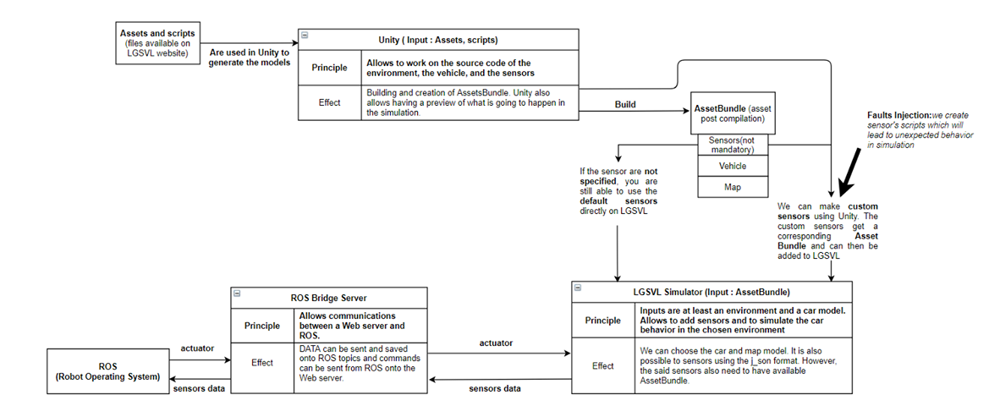

# Principle

To establish the communication between the simulator and the Outside word we decided to use ROS as it comes with a bunch of functions allowing easier communication
between the platforms.



As shown in the upper graph, the communicatio uses a ROS-websocket. Connecting the HMI and the Simulator will allows both of them to see the topic of its neighboor.

I also decided, strictly for my own curiosity to use a web-video-server to get the camera feedback of the smulator's car on an HMI.

# Tutorial 

The tutorial to install ROS in on the following [page](http://wiki.ros.org/hydro/Installation/Ubuntu). Be sure to take the right version coresponding with your ubuntu.

Once you have downloaded ROS you will need a few new packages, the autoware msg, the websocket and the web video server. Those packages are available on the ros_wiki or can be build from sources through git hub. Once you have all the right packages you still have t add the com_simu packages I created to your catkin_ws. 

When you have all of the packages follow the next steps:
1. launch a roscore
2. use ``` sudo apt-get install ros-[distro]-rosbridge-suite``` which will launch the web video server and the websocket
3. try to connect the HMI and the simulator : just check the topic list to know if you are connected ```rostopic list``` ```rostopic echo``` and ```rostopic info```
4. python3 command.py the node for the publisher and the subscriber of the simulator


