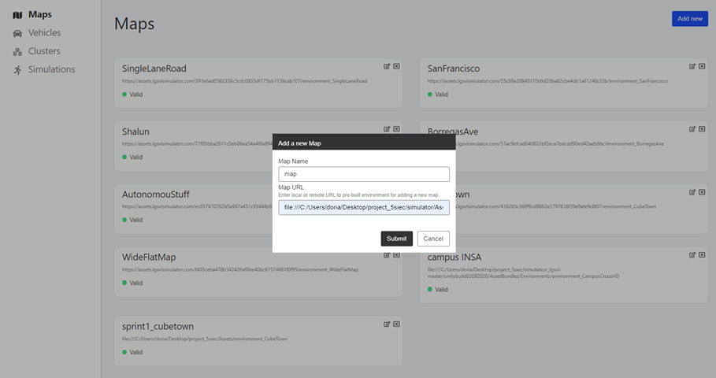
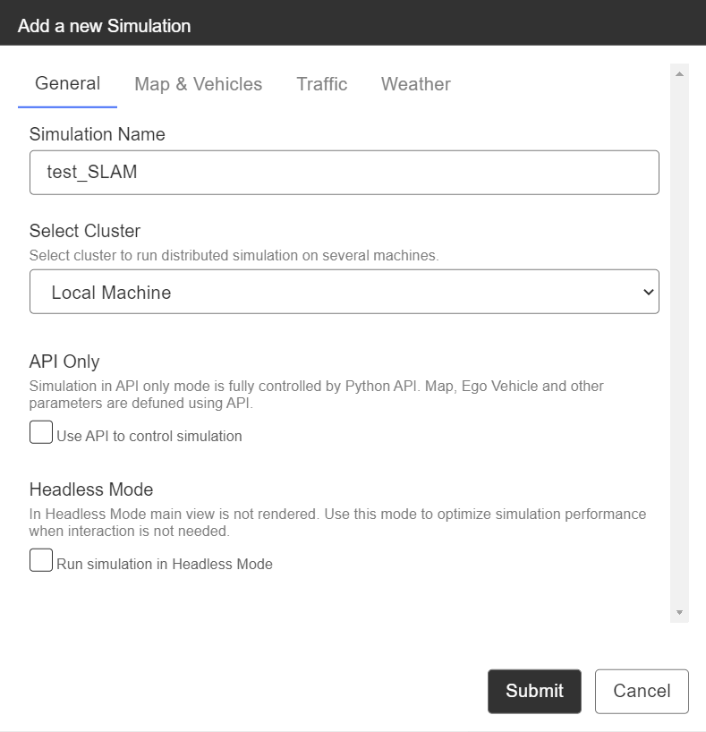
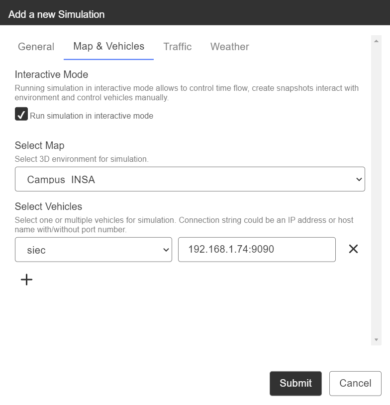

# simulateur_lgsvl_5SIEC

This repository explains the installation and the usage of the simulator [lgsvl](https://www.lgsvlsimulator.com/docs/). The following explanations will be adapted to the work we did with the 5_siec_car.


## Installation: 

1. Download the zip corresponding to your operating system: 
2. Unzip in the folder ypu are going to work with:
3. Run the executable file: 
4. Click on open browser : 


5. On the poping web page you are directly on "the select map" oprion. Select "ADD NEW".
 - For a LGSVL map: give it a name and the link to the concerned map. For example: 
   - Cube town: https://assets.lgsvlsimulator.com/085da734088f2b584075fce2d1d478b98ca076eb/environment_CubeTown 
   - San Francisco: https://assets.lgsvlsimulator.com/29a5d0d9ef094a4b3e333b28eb48254b9f9ef7a1/environment_SanFrancisco


6. Click on "vehicles" on the left side of your screen and proceed usingthe same procedure you will find the right car in "PERSONNAL_PATH\unitybuild02092020\AssetBundles\Vehicles\NAME_OF_THE_CAR " (if the asset is invalid try "\" instead of "/"). For the LGSVL jaguar use the link to https://assets.lgsvlsimulator.com/d49c88a93b11b047a3e21e0c7d4b2ec6964fb16d/vehicle_Jaguar2015XE.

7. You can edit the vehicle J-SON through the key icon. This file allows you to add sensors as well as modifying their paramaters. Select ROS as the bridge type and paste the content of the file "final_j_son" in the sensor field.You can find more information concerning the sensors on the folowing [link] (https://www.lgsvlsimulator.com/docs/sensor-json-options/). Once you are done click on submit: 


8. You are done with the installation.

In case of trouble you can simply follow the LGSVL tutorial as it will explain installation from the sources.

## Launching simulation: 

1. Click on the "simulation" winglet on the left side of the screen.
2. "Add new"
3. In general, give a name to your simulation.


4. In "map and vehicle", check "RUN simulation in interractive mode", select the map and the vehicle you will be using for the simulator. Finally we willneed to pecify a ROS connection since we want to establish communication via ROS.
 - If you use ROS on the same machine as the simulator than simpy put "localhost:9090".
 - Else, if you use, for example, a virtual machine you will have to use your IP address, ex: "192.168.4.65:9090"


5. The rest of the parameters can be ignored and will be editable in simulation if needed.
6. Click on "Submit", the simulation is ready.
7. Click on your simulation and then on the play button.
8. Come back to the simulator window, you are now able to command the vehicle useing your computer's arrows.

##  Functioning with ROS

This simulator was made to be operable with the Robot Operating System, ROS. For this you will need, for ubuntu 18.04 the following model [Melodic](http://wiki.ros.org/melodic/Installation/Ubuntu) or for the 20.04 noetic. ROS is a middleware allowing to rule the comunications between specified nodes.The exchanged informations can be of variable types and are called topics. Each node can share information through publishing and receive it through listening.

### Communication avec ROS

The communication between ROS and the simulator is made through a websocket which needs to be launched on your compter. It can be dfferent from the computer running the simulator but needs to be the same one as where the "roscore" is curently running. Pour put in place this websocket you will have to install package [rosbridge_server](http://wiki.ros.org/rosbridge_suite/Tutorials/RunningRosbridge):
```
sudo apt-get install ros-[distro]-rosbridge-suite
```
